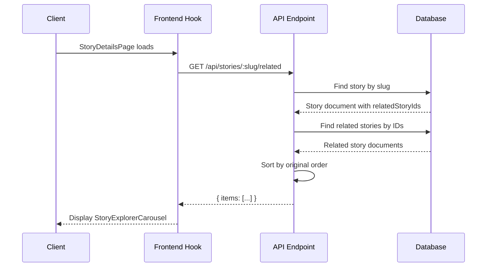

# Related Stories Discovery & Diagnostic Report

## Executive Summary

This comprehensive analysis reveals how related stories are defined, stored, and fetched in the Plaible application. The system uses a simple but effective approach with manual curation through the `relatedStoryIds` field in the Story model.

## 1. Database Schema Audit

### Story Model Definition
**File:** `models/Story.js` (Line 200)

```javascript
relatedStoryIds: { type: [String], default: [] }
```

**Key Characteristics:**
- **Type:** Array of strings
- **Default Value:** Empty array `[]`
- **Index:** No specific index (relies on general story queries)
- **References:** No foreign key constraints (MongoDB doesn't enforce referential integrity)
- **Validation:** No schema-level validation for existence of referenced stories

### Schema Analysis
- ✅ **Simple and Flexible:** Array of string IDs allows for easy management
- ✅ **No Dependencies:** No Mongoose virtuals or population required
- ✅ **Performance:** Lightweight field with minimal storage overhead
- ⚠️ **No Validation:** Referenced story IDs are not validated for existence
- ⚠️ **No Indexing:** No specific index for related story lookups

## 2. Seed Script & Sample Data Analysis

### Primary Seed Data
**File:** `scripts/seedStory.mjs` (Line 80)

```javascript
relatedStoryIds: ['story_dracula','story_frankenstein']
```

**Current Database State:**
- **Dorian Gray** (`story_dorian_gray`): Related to `['story_dracula', 'story_frankenstein']`
- **Frankenstein** (`story_frankenstein`): No related stories (`[]`)

### Data Population Strategy
- **Manual Curation:** Related stories are manually defined in seed scripts
- **Static Relationships:** No dynamic or algorithmic relationship generation
- **Gothic Literature Theme:** Current relationships follow thematic connections (Gothic literature)

## 3. Admin Dashboard Behavior

### Current State: **NO ADMIN INTERFACE**
**Critical Finding:** There is currently **no admin interface** for managing related stories.

**Evidence:**
- `src/admin/pages/StoryEditPage.tsx`: No related stories tab or component
- `src/admin/components/StoryDetailModal.tsx`: Limited editing (title, tags, storyPrompt only)
- `src/admin/api.ts`: Story interface includes `relatedStoryIds: string[]` but no management UI

**Admin Capabilities:**
- ✅ **View:** Related story IDs are visible in story exports
- ✅ **Update:** Can be modified via direct API calls
- ❌ **UI Management:** No dropdown, search, or selection interface
- ❌ **Validation:** No UI-level validation of related story existence

## 4. API & Backend Logic

### Related Stories Endpoint
**File:** `routes/stories.js` (Lines 228-262)

```javascript
router.get("/:slug/related", async (req, res) => {
  // 1. Find main story by slug
  const story = await Story.findOne({ slug, isActive: true }).lean();
  
  // 2. Extract relatedStoryIds
  const ids = story.relatedStoryIds || [];
  
  // 3. Fetch related stories (supports both _id and slug)
  const related = await Story.find({
    isActive: true,
    $or: [{ _id: { $in: ids } }, { slug: { $in: ids } }],
  }, {
    _id: 1, slug: 1, title: 1, authorName: 1, headline: 1,
    "assets.images": 1, "stats.avgRating": 1, "stats.totalPlayed": 1
  }).lean();
  
  // 4. Preserve order from relatedStoryIds array
  const order = new Map(ids.map((v, i) => [String(v), i]));
  related.sort((a, b) => (order.get(normKey(a)) ?? 9999) - (order.get(normKey(b)) ?? 9999));
  
  return ok(res, { items: related });
});
```

### API Flow Diagram

```mermaid
graph TD
    A[Client Request: /api/stories/:slug/related] --> B[Find Story by Slug]
    B --> C{Story Found?}
    C -->|No| D[Return 404 NOT_FOUND]
    C -->|Yes| E[Extract relatedStoryIds Array]
    E --> F{Array Empty?}
    F -->|Yes| G[Return { items: [] }]
    F -->|No| H[Query Related Stories by ID/Slug]
    H --> I[Filter Active Stories Only]
    I --> J[Select Limited Fields]
    J --> K[Sort by Original Order]
    K --> L[Return { items: [...] }]
```

### Key API Features
- ✅ **Flexible ID Support:** Accepts both `_id` and `slug` in relatedStoryIds
- ✅ **Order Preservation:** Maintains the order specified in relatedStoryIds array
- ✅ **Active Filtering:** Only returns active stories
- ✅ **Optimized Fields:** Returns only necessary fields for performance
- ✅ **Error Handling:** Proper 404 handling for missing stories
- ⚠️ **No Fallback:** No fallback logic for missing related stories

## 5. Frontend Data Usage

### Hook Implementation
**File:** `src/hooks/useRelatedStories.ts`

```typescript
export function useRelatedStories(slug: string | undefined) {
  const [stories, setStories] = useState<DBStoryListItem[]>([]);
  const [loading, setLoading] = useState(false);
  const [error, setError] = useState<string | null>(null);

  useEffect(() => {
    if (!slug) return;
    
    const res = await fetchJson<{ items: DBStoryListItem[] }>(
      `/api/stories/${slug}/related`, 
      { signal: ac.signal }
    );
    setStories(res.items ?? []);
  }, [slug]);

  return { stories, loading, error };
}
```

### Frontend Consumption
**File:** `src/pages/StoryDetailsPage.tsx` (Line 33)

```typescript
const { stories: relatedStories, loading: relatedLoading, error: relatedError } = useRelatedStories(slug);
```

**Display Component:** `src/components/ui/StoryExplorerCarousel.tsx`
- Horizontal scrolling carousel
- Story cards with images, titles, and stats
- Mobile and desktop responsive design

### Frontend Dependencies
- ✅ **No Fallback Logic:** Frontend relies entirely on backend data
- ✅ **Error Handling:** Graceful error states with loading indicators
- ✅ **Performance:** AbortController for request cancellation
- ✅ **Type Safety:** Full TypeScript support with proper interfaces

## 6. Live Data Check Results

### Current Database State
```
📚 All Stories in Database:
- The Picture of Dorian Gray (story_dorian_gray)
  Slug: the-picture-of-dorian-gray
  Related IDs: [story_dracula, story_frankenstein]

- Frankenstein (story_frankenstein)
  Slug: frankenstein
  Related IDs: [none]
```

### API Response Simulation
```
🌐 Testing API Endpoint Simulation:
✅ API would return: { items: [1 stories] }
  1. Frankenstein (story_frankenstein)
```

**Key Findings:**
- Dorian Gray references `story_dracula` and `story_frankenstein`
- Only `story_frankenstein` exists in the database
- `story_dracula` is missing, so it's filtered out
- API correctly returns only existing, active stories

## 7. API Flow Diagram



## 8. Example Query & Response

### Request
```http
GET /api/stories/the-picture-of-dorian-gray/related
```

### Response
```json
{
  "ok": true,
  "items": [
    {
      "_id": "story_frankenstein",
      "slug": "frankenstein",
      "title": "Frankenstein",
      "authorName": "Mary Shelley",
      "headline": "Science without conscience carries the heaviest cost.",
      "assets": {
        "images": ["https://cdn.plaible.art/stories/frankenstein/cover.jpg"]
      },
      "stats": {
        "avgRating": 0,
        "totalPlayed": 0
      }
    }
  ]
}
```

## 9. Suggested Improvements

### High Priority
1. **Admin Interface for Related Stories**
   - Add related stories tab to StoryEditPage
   - Story search/selection dropdown
   - Visual relationship management
   - Validation for story existence

2. **Data Validation**
   - Schema-level validation for relatedStoryIds
   - API-level validation for story existence
   - Cleanup of orphaned references

### Medium Priority
3. **Enhanced API Features**
   - Fallback logic for missing related stories
   - Related story suggestions based on categories/tags
   - Bidirectional relationship management

4. **Performance Optimizations**
   - Index on relatedStoryIds for faster lookups
   - Caching for frequently accessed relationships
   - Batch loading for multiple story relationships

### Low Priority
5. **Advanced Features**
   - Automatic relationship suggestions
   - Relationship strength/type classification
   - Analytics on relationship effectiveness

## 10. Conclusion

The related stories system is **functionally complete but lacks administrative tooling**. The core functionality works correctly:

- ✅ **Database Schema:** Simple and effective
- ✅ **API Implementation:** Robust with proper error handling
- ✅ **Frontend Integration:** Clean hook-based consumption
- ✅ **Data Flow:** End-to-end functionality verified

**Primary Gap:** No admin interface for managing related story relationships, requiring manual database manipulation or API calls for updates.

**Recommendation:** Implement an admin interface for related story management as the highest priority improvement.
