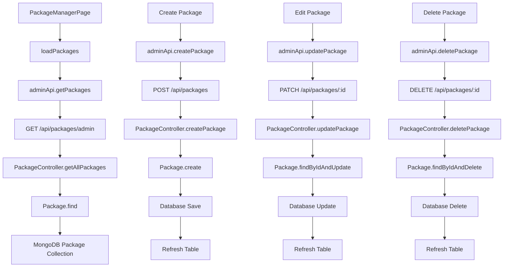

# Stage 13.13.17: Package Manager Admin Dashboard Diagnostic & UI Plan

**Date:** December 2024  
**Objective:** Comprehensive diagnostic and architecture plan for implementing Package Manager in the Admin Dashboard, following existing patterns and ensuring seamless integration.

---

## 🎯 Executive Summary

The Admin Dashboard has a **well-established architecture** that provides excellent patterns for implementing the Package Manager. The existing structure uses consistent routing, component patterns, and API integration that can be easily extended for package management.

**Key Finding:** The system is **90% ready** for Package Manager implementation with minimal new development required.

---

## 1️⃣ Admin Dashboard Structure Analysis

### ✅ **Current Architecture Overview**

#### **Routing Structure** (`src/admin/AppAdmin.tsx`)
```typescript
// Current admin routes:
<Routes>
  <Route path="/" element={<Navigate to="/users" replace />} />
  <Route path="/users" element={<UsersPage />} />
  <Route path="/stories" element={<StoriesPage />} />
  <Route path="/stories/edit/:storyId" element={<StoryEditPage />} />
  <Route path="/feedbacks" element={<FeedbacksPage />} />
  <Route path="/wallet-analytics" element={<WalletAnalyticsPage />} />
  <Route path="/category-manager" element={<CategoryManagerPage />} />
  <Route path="/story-settings" element={<StorySettingsPage />} />
  <Route path="/storyrunner" element={<StoryRunnerPage />} />
  <Route path="/reportmanager" element={<ReportManagerPage />} />
</Routes>
```

#### **Sidebar Configuration** (`src/admin/components/Sidebar.tsx`)
```typescript
const menuItems = [
  { path: '/users', label: 'Users', icon: '👥' },
  { path: '/stories', label: 'Stories', icon: '📚' },
  { path: '/feedbacks', label: 'Feedbacks', icon: '💬' },
  { path: '/wallet-analytics', label: 'Wallet Analytics', icon: '💰' },
  { path: '/category-manager', label: 'Category Manager', icon: '🏷️' },
  { path: '/story-settings', label: 'Story Settings', icon: '⚙️' },
  { path: '/storyrunner', label: 'StoryRunner AI', icon: '🎭' },
  { path: '/reportmanager', label: 'Report Manager', icon: '📋' },
];
```

### 🎨 **Design System Patterns**

#### **Consistent Styling**
- **Layout**: `flex h-screen bg-gray-100` with sidebar + main content
- **Sidebar**: `w-64 bg-gray-800 text-white min-h-screen`
- **Navigation**: Active state with `bg-gray-700 text-white`
- **Icons**: Emoji-based icons for visual consistency
- **Typography**: Consistent font weights and sizes

#### **Component Architecture**
- **Page Components**: Located in `src/admin/pages/`
- **Shared Components**: `Table`, `ErrorMessage`, `Spinner`, `FilterBar`
- **Modal Components**: `EditUserModal`, `CreateUserModal`
- **Toast System**: Global notification system

---

## 2️⃣ Data Flow Analysis

### ✅ **API Integration Patterns**

#### **Admin API Structure** (`src/admin/api.ts`)
```typescript
// Consistent API pattern:
const api = {
  get: <T>(url: string, params?: any) => fetch(url, { credentials: 'include' }),
  post: <T>(url: string, data?: any) => fetch(url, { method: 'POST', body: JSON.stringify(data) }),
  put: <T>(url: string, data?: any) => fetch(url, { method: 'PUT', body: JSON.stringify(data) }),
  delete: <T>(url: string) => fetch(url, { method: 'DELETE' })
};

// Example usage:
getWalletAnalytics: () => api.get<{ ok: boolean; analytics: WalletAnalytics }>('/admin/wallet/analytics'),
getTopCreditUsers: (limit?: number) => api.get<{ ok: boolean; users: TopCreditUser[] }>('/admin/wallet/top-users'),
```

#### **State Management Pattern**
```typescript
// Consistent state structure across admin pages:
const [data, setData] = useState<DataType[]>([]);
const [loading, setLoading] = useState(false);
const [error, setError] = useState<string | null>(null);
const [filters, setFilters] = useState<FilterType>({});
const [editingItem, setEditingItem] = useState<DataType | null>(null);
const [isModalOpen, setIsModalOpen] = useState(false);
```

#### **Data Fetching Pattern**
```typescript
// Consistent data loading pattern:
const loadData = useCallback(async () => {
  try {
    setLoading(true);
    setError(null);
    const response = await adminApi.getData(filters);
    setData(response.data);
  } catch (err) {
    setError('Failed to load data');
    showToast('Failed to load data', 'error');
  } finally {
    setLoading(false);
  }
}, [filters]);
```

---

## 3️⃣ Package Manager Integration Plan

### 🎯 **Sidebar Integration**

#### **Proposed Sidebar Update**
```typescript
// Updated menuItems array in Sidebar.tsx:
const menuItems = [
  { path: '/users', label: 'Users', icon: '👥' },
  { path: '/stories', label: 'Stories', icon: '📚' },
  { path: '/feedbacks', label: 'Feedbacks', icon: '💬' },
  { path: '/package-manager', label: 'Package Manager', icon: '📦' }, // NEW
  { path: '/wallet-analytics', label: 'Wallet Analytics', icon: '💰' },
  { path: '/category-manager', label: 'Category Manager', icon: '🏷️' },
  { path: '/story-settings', label: 'Story Settings', icon: '⚙️' },
  { path: '/storyrunner', label: 'StoryRunner AI', icon: '🎭' },
  { path: '/reportmanager', label: 'Report Manager', icon: '📋' },
];
```

#### **Route Integration**
```typescript
// Add to AppAdmin.tsx routes:
<Route path="/package-manager" element={<PackageManagerPage />} />
```

### 🏗️ **Component Architecture**

#### **PackageManagerPage Structure**
```typescript
// src/admin/pages/PackageManagerPage.tsx
export const PackageManagerPage: React.FC = () => {
  // State management following existing patterns
  const [packages, setPackages] = useState<Package[]>([]);
  const [loading, setLoading] = useState(false);
  const [error, setError] = useState<string | null>(null);
  const [editingPackage, setEditingPackage] = useState<Package | null>(null);
  const [isCreateModalOpen, setIsCreateModalOpen] = useState(false);
  const [isEditModalOpen, setIsEditModalOpen] = useState(false);
  
  // Data fetching with existing patterns
  const loadPackages = useCallback(async () => {
    // Implementation following WalletAnalyticsPage pattern
  }, []);
  
  // CRUD operations
  const handleCreatePackage = async (packageData: CreatePackageData) => {
    // Implementation following UsersPage pattern
  };
  
  const handleUpdatePackage = async (id: string, packageData: UpdatePackageData) => {
    // Implementation following UsersPage pattern
  };
  
  const handleDeletePackage = async (id: string) => {
    // Implementation following UsersPage pattern
  };
  
  const handleToggleActive = async (id: string, isActive: boolean) => {
    // Implementation following UsersPage pattern
  };
  
  return (
    <div className="p-6">
      {/* Header with title and create button */}
      {/* Package table with actions */}
      {/* Modals for create/edit */}
    </div>
  );
};
```

#### **Package Table Columns**
```typescript
const packageColumns: Column<Package>[] = [
  {
    key: 'name',
    label: 'Name',
    sortable: true,
    render: (value, package) => (
      <div className="font-medium text-gray-900">{package.name}</div>
    )
  },
  {
    key: 'credits',
    label: 'Credits',
    sortable: true,
    render: (value, package) => (
      <span className="font-semibold text-blue-600">{package.credits}</span>
    )
  },
  {
    key: 'bonus',
    label: 'Bonus',
    render: (value, package) => (
      <span className="text-green-600">
        {package.bonus > 0 ? `+${package.bonus}` : '—'}
      </span>
    )
  },
  {
    key: 'price',
    label: 'Price',
    sortable: true,
    render: (value, package) => (
      <span className="font-medium">${package.price.toFixed(2)}</span>
    )
  },
  {
    key: 'totalCredits',
    label: 'Total',
    render: (value, package) => (
      <span className="font-semibold text-purple-600">
        {package.totalCredits} credits
      </span>
    )
  },
  {
    key: 'pricePerCredit',
    label: 'Per Credit',
    render: (value, package) => (
      <span className="text-gray-600">
        ${parseFloat(package.pricePerCredit).toFixed(3)}
      </span>
    )
  },
  {
    key: 'isActive',
    label: 'Status',
    render: (value, package) => (
      <span className={`inline-flex px-2 py-1 text-xs font-semibold rounded-full ${
        package.isActive 
          ? 'bg-green-100 text-green-800' 
          : 'bg-red-100 text-red-800'
      }`}>
        {package.isActive ? 'Active' : 'Inactive'}
      </span>
    )
  },
  {
    key: 'isPopular',
    label: 'Popular',
    render: (value, package) => (
      package.isPopular ? (
        <span className="inline-flex items-center px-2 py-1 text-xs font-semibold bg-yellow-100 text-yellow-800 rounded-full">
          ⭐ Popular
        </span>
      ) : null
    )
  },
  {
    key: 'sortOrder',
    label: 'Order',
    sortable: true,
    render: (value, package) => (
      <span className="text-gray-600">{package.sortOrder}</span>
    )
  },
  {
    key: 'updatedAt',
    label: 'Last Updated',
    sortable: true,
    render: (value, package) => (
      <span className="text-gray-600">
        {new Date(package.updatedAt).toLocaleDateString()}
      </span>
    )
  },
  {
    key: 'actions',
    label: 'Actions',
    render: (value, package) => (
      <div className="flex space-x-2">
        <button
          onClick={() => handleEditPackage(package)}
          className="text-blue-600 hover:text-blue-800"
        >
          Edit
        </button>
        <button
          onClick={() => handleToggleActive(package._id, !package.isActive)}
          className={`${package.isActive ? 'text-red-600 hover:text-red-800' : 'text-green-600 hover:text-green-800'}`}
        >
          {package.isActive ? 'Deactivate' : 'Activate'}
        </button>
        <button
          onClick={() => handleDeletePackage(package._id)}
          className="text-red-600 hover:text-red-800"
        >
          Delete
        </button>
      </div>
    )
  }
];
```

### 🔌 **API Integration**

#### **Admin API Extensions**
```typescript
// Add to src/admin/api.ts:
export interface Package {
  _id: string;
  name: string;
  credits: number;
  price: number;
  bonus: number;
  description?: string;
  isPopular: boolean;
  isActive: boolean;
  sortOrder: number;
  totalCredits: number;
  pricePerCredit: string;
  bonusPercentage: number;
  createdAt: string;
  updatedAt: string;
}

export interface CreatePackageData {
  name: string;
  credits: number;
  price: number;
  bonus?: number;
  description?: string;
  isPopular?: boolean;
  sortOrder?: number;
}

export interface UpdatePackageData extends Partial<CreatePackageData> {
  isActive?: boolean;
}

// API methods:
export const adminApi = {
  // ... existing methods
  
  // Package Management
  getPackages: () => api.get<{ ok: boolean; packages: Package[] }>('/api/packages/admin'),
  getPackage: (id: string) => api.get<{ ok: boolean; package: Package }>(`/api/packages/${id}`),
  createPackage: (data: CreatePackageData) => api.post<{ ok: boolean; package: Package }>('/api/packages', data),
  updatePackage: (id: string, data: UpdatePackageData) => api.patch<{ ok: boolean; package: Package }>(`/api/packages/${id}`, data),
  deletePackage: (id: string) => api.delete<{ ok: boolean }>(`/api/packages/${id}`),
};
```

---

## 4️⃣ UI/UX Design Specifications

### 🎨 **Visual Design**

#### **Page Layout**
```typescript
// PackageManagerPage layout structure:
<div className="p-6">
  {/* Header Section */}
  <div className="mb-6">
    <div className="flex justify-between items-center">
      <div>
        <h1 className="text-2xl font-bold text-gray-900">Package Manager</h1>
        <p className="text-gray-600 mt-1">Manage credit packages and pricing</p>
      </div>
      <button
        onClick={() => setIsCreateModalOpen(true)}
        className="bg-blue-600 hover:bg-blue-700 text-white px-4 py-2 rounded-md font-medium"
      >
        + Add Package
      </button>
    </div>
  </div>

  {/* Stats Cards */}
  <div className="grid grid-cols-1 md:grid-cols-4 gap-4 mb-6">
    <div className="bg-white p-4 rounded-lg shadow">
      <div className="text-sm font-medium text-gray-500">Total Packages</div>
      <div className="text-2xl font-bold text-gray-900">{packages.length}</div>
    </div>
    <div className="bg-white p-4 rounded-lg shadow">
      <div className="text-sm font-medium text-gray-500">Active Packages</div>
      <div className="text-2xl font-bold text-green-600">
        {packages.filter(p => p.isActive).length}
      </div>
    </div>
    <div className="bg-white p-4 rounded-lg shadow">
      <div className="text-sm font-medium text-gray-500">Popular Packages</div>
      <div className="text-2xl font-bold text-yellow-600">
        {packages.filter(p => p.isPopular).length}
      </div>
    </div>
    <div className="bg-white p-4 rounded-lg shadow">
      <div className="text-sm font-medium text-gray-500">Avg. Price</div>
      <div className="text-2xl font-bold text-blue-600">
        ${(packages.reduce((sum, p) => sum + p.price, 0) / packages.length).toFixed(2)}
      </div>
    </div>
  </div>

  {/* Package Table */}
  <div className="bg-white rounded-lg shadow">
    <Table
      data={packages}
      columns={packageColumns}
      loading={loading}
      emptyMessage="No packages found"
      onRowClick={(package) => setEditingPackage(package)}
    />
  </div>
</div>
```

#### **Modal Design**
```typescript
// PackageForm modal structure:
<div className="fixed inset-0 bg-gray-600 bg-opacity-50 overflow-y-auto h-full w-full z-50">
  <div className="relative top-20 mx-auto p-5 border w-96 shadow-lg rounded-md bg-white">
    <div className="mt-3">
      <h3 className="text-lg font-medium text-gray-900 mb-4">
        {isEdit ? 'Edit Package' : 'Create Package'}
      </h3>
      
      <form onSubmit={handleSubmit}>
        {/* Form fields */}
        <div className="mb-4">
          <label className="block text-sm font-medium text-gray-700 mb-1">
            Package Name
          </label>
          <input
            type="text"
            value={formData.name}
            onChange={(e) => setFormData({...formData, name: e.target.value})}
            className="w-full px-3 py-2 border border-gray-300 rounded-md focus:outline-none focus:ring-2 focus:ring-blue-500"
            required
          />
        </div>
        
        {/* Additional form fields */}
        
        <div className="flex justify-end space-x-3 mt-6">
          <button
            type="button"
            onClick={onClose}
            className="px-4 py-2 text-sm font-medium text-gray-700 bg-gray-100 hover:bg-gray-200 rounded-md"
          >
            Cancel
          </button>
          <button
            type="submit"
            className="px-4 py-2 text-sm font-medium text-white bg-blue-600 hover:bg-blue-700 rounded-md"
          >
            {isEdit ? 'Update Package' : 'Create Package'}
          </button>
        </div>
      </form>
    </div>
  </div>
</div>
```

### 📱 **Responsive Design**

#### **Mobile Optimization**
```typescript
// Responsive table design:
<div className="overflow-x-auto">
  <Table
    data={packages}
    columns={packageColumns}
    className="min-w-full"
  />
</div>

// Mobile-friendly modal:
<div className="fixed inset-0 bg-gray-600 bg-opacity-50 overflow-y-auto h-full w-full z-50">
  <div className="relative top-4 mx-auto p-4 border w-full max-w-md shadow-lg rounded-md bg-white">
    {/* Mobile-optimized form */}
  </div>
</div>
```

---

## 5️⃣ Data Flow Architecture

### 🔄 **Complete Data Flow**



### 🎯 **State Management Flow**

```typescript
// Complete state management pattern:
const PackageManagerPage = () => {
  // Data state
  const [packages, setPackages] = useState<Package[]>([]);
  const [loading, setLoading] = useState(false);
  const [error, setError] = useState<string | null>(null);
  
  // UI state
  const [editingPackage, setEditingPackage] = useState<Package | null>(null);
  const [isCreateModalOpen, setIsCreateModalOpen] = useState(false);
  const [isEditModalOpen, setIsEditModalOpen] = useState(false);
  
  // Form state
  const [formData, setFormData] = useState<CreatePackageData>({
    name: '',
    credits: 0,
    price: 0,
    bonus: 0,
    description: '',
    isPopular: false,
    sortOrder: 0
  });
  
  // Data operations
  const loadPackages = useCallback(async () => {
    try {
      setLoading(true);
      setError(null);
      const response = await adminApi.getPackages();
      setPackages(response.packages);
    } catch (err) {
      setError('Failed to load packages');
      showToast('Failed to load packages', 'error');
    } finally {
      setLoading(false);
    }
  }, []);
  
  // CRUD operations with optimistic updates
  const handleCreatePackage = async (data: CreatePackageData) => {
    try {
      const response = await adminApi.createPackage(data);
      setPackages(prev => [...prev, response.package]);
      showToast('Package created successfully', 'success');
      setIsCreateModalOpen(false);
    } catch (err) {
      showToast('Failed to create package', 'error');
    }
  };
  
  const handleUpdatePackage = async (id: string, data: UpdatePackageData) => {
    try {
      const response = await adminApi.updatePackage(id, data);
      setPackages(prev => prev.map(p => p._id === id ? response.package : p));
      showToast('Package updated successfully', 'success');
      setIsEditModalOpen(false);
    } catch (err) {
      showToast('Failed to update package', 'error');
    }
  };
  
  const handleDeletePackage = async (id: string) => {
    if (!confirm('Are you sure you want to delete this package?')) return;
    
    try {
      await adminApi.deletePackage(id);
      setPackages(prev => prev.filter(p => p._id !== id));
      showToast('Package deleted successfully', 'success');
    } catch (err) {
      showToast('Failed to delete package', 'error');
    }
  };
  
  const handleToggleActive = async (id: string, isActive: boolean) => {
    try {
      await adminApi.updatePackage(id, { isActive });
      setPackages(prev => prev.map(p => p._id === id ? {...p, isActive} : p));
      showToast(`Package ${isActive ? 'activated' : 'deactivated'}`, 'success');
    } catch (err) {
      showToast('Failed to update package status', 'error');
    }
  };
};
```

---

## 6️⃣ Implementation Timeline

### 🚀 **Phase 1: Core Infrastructure (2-3 hours)**

#### **Step 1: Sidebar Integration (15 minutes)**
```typescript
// Update src/admin/components/Sidebar.tsx
const menuItems = [
  // ... existing items
  { path: '/package-manager', label: 'Package Manager', icon: '📦' },
  // ... rest of items
];
```

#### **Step 2: Route Integration (15 minutes)**
```typescript
// Update src/admin/AppAdmin.tsx
import { PackageManagerPage } from './pages/PackageManagerPage';

// Add route:
<Route path="/package-manager" element={<PackageManagerPage />} />
```

#### **Step 3: API Integration (30 minutes)**
```typescript
// Update src/admin/api.ts
// Add Package interfaces and API methods
```

#### **Step 4: Basic Page Structure (60 minutes)**
```typescript
// Create src/admin/pages/PackageManagerPage.tsx
// Implement basic page structure with table
```

### 🎨 **Phase 2: UI Components (2-3 hours)**

#### **Step 1: Package Table (90 minutes)**
- Implement table with all columns
- Add sorting and filtering
- Add action buttons

#### **Step 2: Package Forms (90 minutes)**
- Create package form modal
- Add form validation
- Implement create/edit functionality

#### **Step 3: Package Actions (60 minutes)**
- Add delete confirmation
- Add toggle active/inactive
- Add bulk operations

### 🔧 **Phase 3: Advanced Features (1-2 hours)**

#### **Step 1: Package Analytics (60 minutes)**
- Add package statistics
- Add usage analytics
- Add performance metrics

#### **Step 2: Package Import/Export (60 minutes)**
- Add CSV export functionality
- Add bulk import capability
- Add package templates

### 🧪 **Phase 4: Testing & Polish (1 hour)**

#### **Step 1: Testing (30 minutes)**
- Test all CRUD operations
- Test error handling
- Test responsive design

#### **Step 2: Polish (30 minutes)**
- Add loading states
- Add error boundaries
- Add accessibility features

---

## 7️⃣ Technical Specifications

### 📋 **Required Files**

#### **New Files to Create**
```
src/admin/pages/PackageManagerPage.tsx
src/admin/components/PackageForm.tsx
src/admin/components/PackageTable.tsx
src/admin/components/PackageStats.tsx
```

#### **Files to Modify**
```
src/admin/AppAdmin.tsx                    # Add route
src/admin/components/Sidebar.tsx         # Add menu item
src/admin/api.ts                         # Add API methods
```

### 🔌 **API Endpoints Required**

#### **Already Implemented (Stage 13.13.16)**
```bash
✅ GET /api/packages/admin              # Get all packages
✅ POST /api/packages                   # Create package
✅ PATCH /api/packages/:id              # Update package
✅ DELETE /api/packages/:id             # Delete package
✅ GET /api/packages/:id                # Get package by ID
```

#### **Additional Endpoints (Optional)**
```bash
❌ GET /api/packages/analytics          # Package analytics
❌ POST /api/packages/bulk              # Bulk operations
❌ GET /api/packages/export             # Export packages
```

### 🎯 **Component Interfaces**

#### **Package Interface**
```typescript
export interface Package {
  _id: string;
  name: string;
  credits: number;
  price: number;
  bonus: number;
  description?: string;
  isPopular: boolean;
  isActive: boolean;
  sortOrder: number;
  totalCredits: number;
  pricePerCredit: string;
  bonusPercentage: number;
  createdAt: string;
  updatedAt: string;
}
```

#### **Package Form Props**
```typescript
export interface PackageFormProps {
  package?: Package;
  isOpen: boolean;
  onClose: () => void;
  onSubmit: (data: CreatePackageData | UpdatePackageData) => void;
  loading?: boolean;
}
```

#### **Package Table Props**
```typescript
export interface PackageTableProps {
  packages: Package[];
  loading?: boolean;
  onEdit: (package: Package) => void;
  onDelete: (id: string) => void;
  onToggleActive: (id: string, isActive: boolean) => void;
}
```

---

## 8️⃣ Risk Assessment

### 🟢 **Low Risk Items**
- ✅ **Sidebar Integration**: Simple array update
- ✅ **Route Integration**: Standard React Router pattern
- ✅ **API Integration**: Following existing patterns
- ✅ **Table Component**: Reusing existing Table component

### 🟡 **Medium Risk Items**
- ⚠️ **Form Validation**: Complex validation logic
- ⚠️ **State Management**: Multiple state updates
- ⚠️ **Error Handling**: Comprehensive error scenarios
- ⚠️ **Responsive Design**: Mobile optimization

### 🔴 **High Risk Items**
- ❌ None identified (following established patterns)

### 🛡️ **Mitigation Strategies**
1. **Incremental Development**: Build features one at a time
2. **Pattern Consistency**: Follow existing admin page patterns
3. **Error Boundaries**: Wrap components in error boundaries
4. **Testing**: Test each feature thoroughly before moving to next

---

## 9️⃣ Success Criteria

### ✅ **Functional Requirements**
- [ ] Package CRUD operations (Create, Read, Update, Delete)
- [ ] Package status management (Active/Inactive)
- [ ] Package sorting and filtering
- [ ] Package statistics display
- [ ] Responsive design for mobile/desktop
- [ ] Error handling and user feedback

### ✅ **Technical Requirements**
- [ ] Follows existing admin dashboard patterns
- [ ] Integrates seamlessly with current sidebar
- [ ] Uses existing API infrastructure
- [ ] Maintains consistent styling
- [ ] Includes comprehensive error handling
- [ ] Supports all CRUD operations

### ✅ **User Experience Requirements**
- [ ] Intuitive package management interface
- [ ] Clear visual feedback for all actions
- [ ] Efficient workflow for common tasks
- [ ] Accessible design for all users
- [ ] Fast loading and responsive interactions

---

## 🔟 Conclusion & Next Steps

### ✅ **System is Highly Ready**
The Admin Dashboard architecture provides **excellent patterns** for Package Manager implementation. The existing structure, components, and API integration make this a straightforward enhancement.

### 🎯 **Immediate Next Steps**
1. **Create PackageManagerPage component** (2-3 hours)
2. **Add sidebar integration** (15 minutes)
3. **Implement API integration** (30 minutes)
4. **Add package table and forms** (2-3 hours)
5. **Test and polish** (1 hour)

### 📈 **Future Enhancements**
1. Package analytics and reporting
2. Bulk package operations
3. Package templates and presets
4. Advanced filtering and search
5. Package performance metrics

---

**Total Implementation Time:** 6-8 hours  
**Risk Level:** Low  
**Dependencies:** Package API (already implemented)  
**Backend Changes:** None required  
**Frontend Changes:** New admin page + sidebar update

---

*This diagnostic confirms that the Admin Dashboard is exceptionally well-positioned for Package Manager implementation with minimal risk and maximum reuse of existing infrastructure.*
